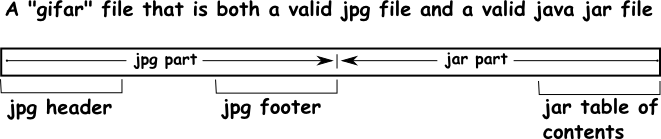

https://medium.com/swlh/polyglot-files-a-hackers-best-friend-850bf812dd8a

-Files are nothing but  a sequence of bytes, how we interprete them is what makes the difference.The rules that define how the bytes of a particular file are supposed 
to be interpreted are called a file format.
File  extensions can lie! The only real way to know the type of the file is to examine its bytes and see what format it's in. Usually, the first few bytes tell you the type
reliably

-File headers:
A header is a short sequence of data at the head, or beginning, of the file data, which doesn't change for all the files with the same type.
png	89 50 4e 47	> .PNG
jpg	FF D8 FF E0 >	ÿØÿà
bmp	42 4D 	>BM
mp3	FF Fx 	> ÿ.
pdf	25 50 44 46	> %PDF
zip	50 4B 03 04	> PK..

->it's easy to lie with extensions, but quite hard to lie with headers!

-What are Polyglots ?
Polyglots, in a security context, are files that are a valid form of multiple different file types.
Polyglot files are often used to bypass protection based on file types. Many applications that allow users to upload files only allow uploads of certain types, such as JPEG, GIF,
DOC, so as to prevent users from uploading potentially dangerous files like JS files, PHP files or Phar files.

-Phar-JPEG file:
Phar files (PHp ARchive) are used to carry out PHP object injection attacks,This type of attack can lead to RCE. However, it requires the attacker to be able to upload a
readable Phar file,
and Phar files are not often allowed by file upload functionalities. So a Phar-JPEG file allows the malicious upload to look like a harmless JPEG file to bypass upload restrictions
but still retain the capabilities of a Phar file.

-"GIFAR" Files:
we can create a single file (sequence of bytes) that satisfies the formatting rules both for an image format and for an "archive" format.
for instance, we can create a single file that is a valid .jpg image file and a valid Java .jar (a file that's intended to be processed by the program "java"). 
This works because a jpg file must have a jpg header as its first several bytes, and must have a jpg footer indicating the end of the image data, but not necessarily the 
end of the file. There can be more bytes after the jpg footer, but any jpg viewer simply ignores them. Meanwhile, Java processes a jar file starting with the bytes at the 
back end of the file. These bytes act as a sort of "table of contents" that tells Java how far forward in the file to jump for other pieces of Java-specific data. The table of
contents in a gifar never tells Java to look as far forward in the file as the jpg footer or beyond.

